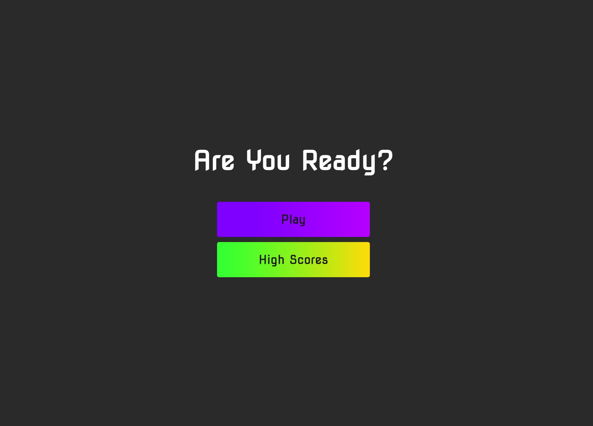
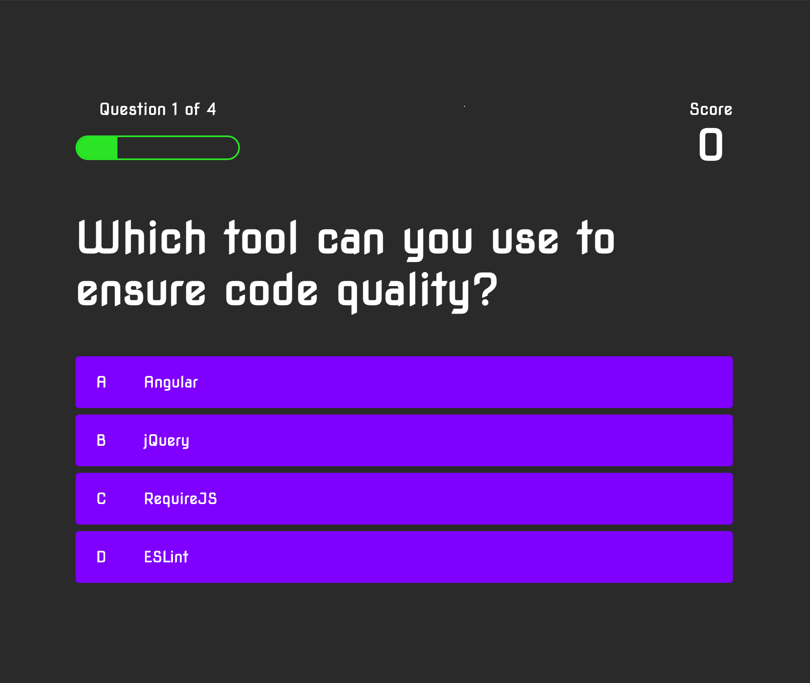
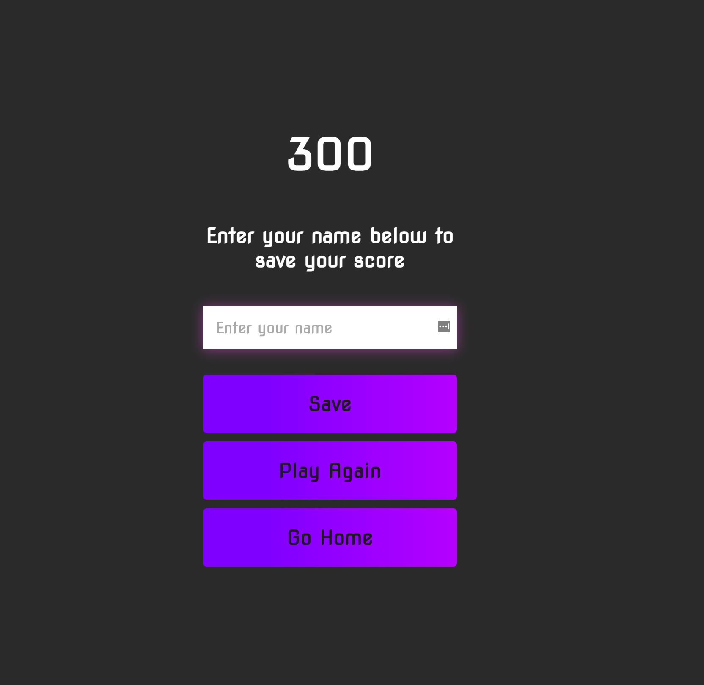
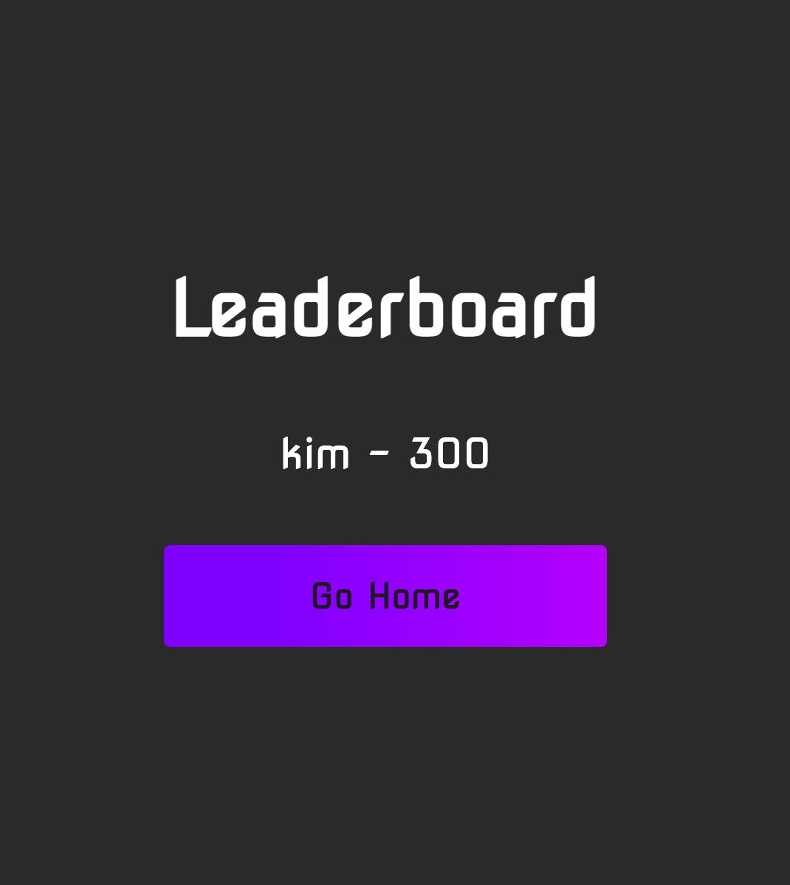

# code-quiz

# Description

This is an application with multiple choice questions that keeps score!

# Frameworks
This app runs in the browser, and will feature dynamically updated HTML and CSS powered is by JavaScript.

# Links and Images

Github Repo: https://github.com/salask24/code-quiz
Direct Link to Javascript quiz: https://salask24.github.io/code-quiz/

